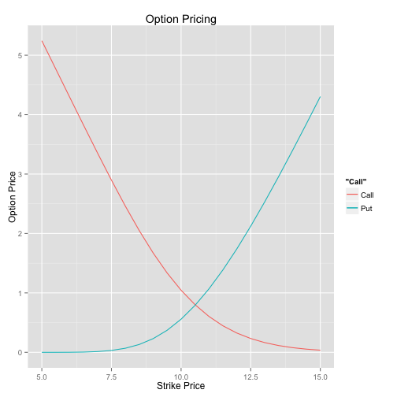
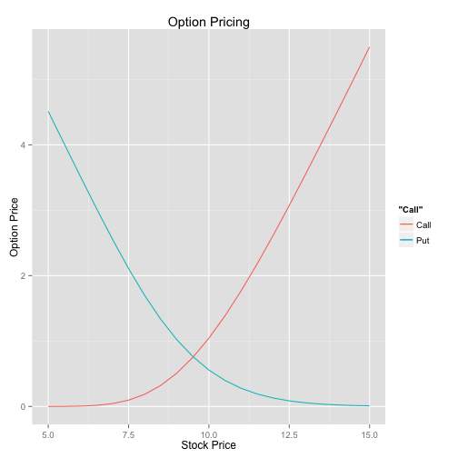

## Introduction

The following slides will give an overview of how option values change if either time to maturity, stock price, strike price or volatility are adjusted, everything else equal.
Generally, the values are set to:
* Strike Price: 10
* Stock Price: 10
* Volatility: 0.20
* Time to Maturity: 1.0
* Interest Rate: 0.05

--- .class #id 

## How Does the Volatility Affect the Option Price?

 

--- .class #id 

## How Does the Strike Price Affect the Option Price?

 

--- .class #id 

## How Does the Stock Price Affect the Option Price?

 

--- .class #id 

## How Does the Time to MaturityAffect the Option Price?

 

--- .class #id 
